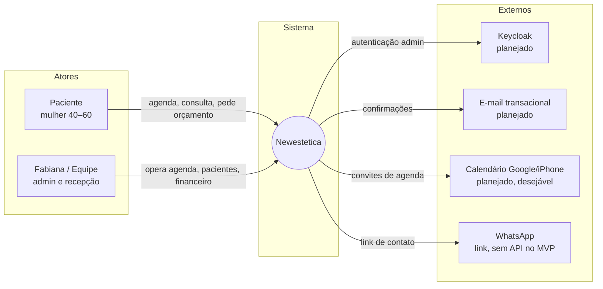

# C1 — Diagrama de Contexto — Newestetica

O sistema Newestetica, seus atores e os sistemas externos já decididos (`docs/02-arquitetura.md`, `docs/04-decisoes-tecnicas.md`).

- **Paciente:** agenda sozinha, consulta catálogo, pede orçamento, lê conteúdo.
- **Fabiana/Equipe:** controla slots, pacientes, procedimentos, histórico, financeiro e usuários.
- Externos marcados como **planejado** ainda não existem; o link de WhatsApp é o único contato real no MVP.

> Este diagrama deve ser atualizado como parte do Verify de qualquer Change que altere sua camada.
