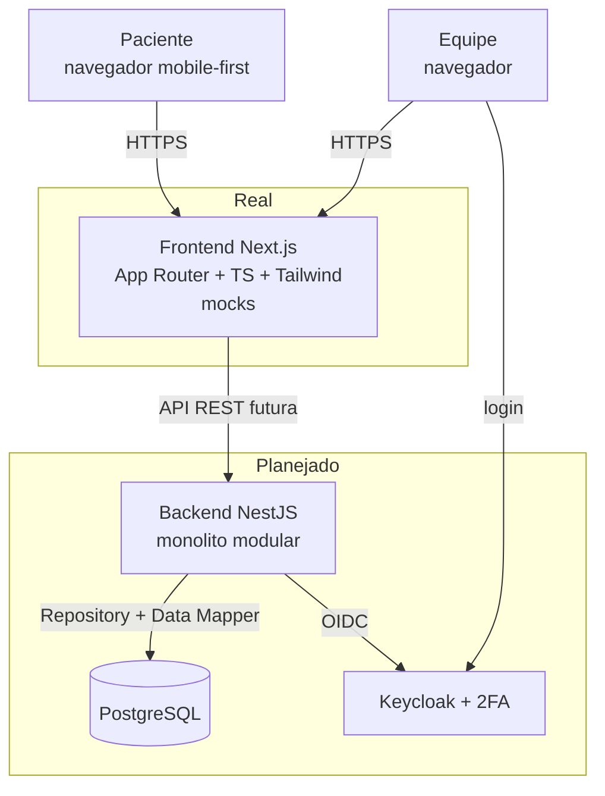

# C2 — Diagrama de Contêineres — Newestetica

Contêineres do sistema — o que é real hoje vs. planejado (`docs/02-arquitetura.md`).

- **Real:** somente o Frontend com mocks e a camada de dados isolada pronta para a troca.
- **Planejado:** Backend, PostgreSQL e Keycloak entram após a validação visual, via contratos em `contracts/`.
- Nenhum outro contêiner existe ou está previsto no MVP (sem microserviços, sem app nativo).

> Este diagrama deve ser atualizado como parte do Verify de qualquer Change que altere sua camada.
