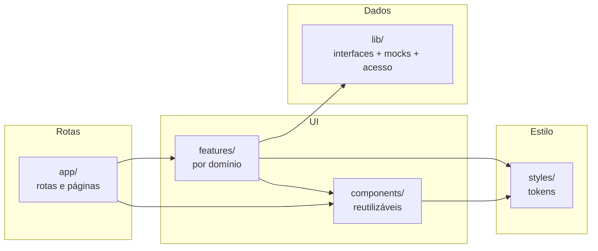

# C3 — Diagrama de Componentes — Frontend (real)

Componentes existentes do frontend (`frontend/`). O backend será detalhado por módulo quando implementado.

- Pastas verificadas no repositório: `app/`, `components/`, `features/`, `lib/`, `styles/`.
- Regra: componentes consomem `lib/` via interfaces; trocar mocks pela API altera só `lib/`.

## Backend (placeholder normatizado)

Quando cada módulo for implementado, detalhar aqui suas camadas — Domain, Application, Infrastructure, Presentation (`docs/02-arquitetura.md` §7) — módulo a módulo, não antes.

> Este diagrama deve ser atualizado como parte do Verify de qualquer Change que altere sua camada.
