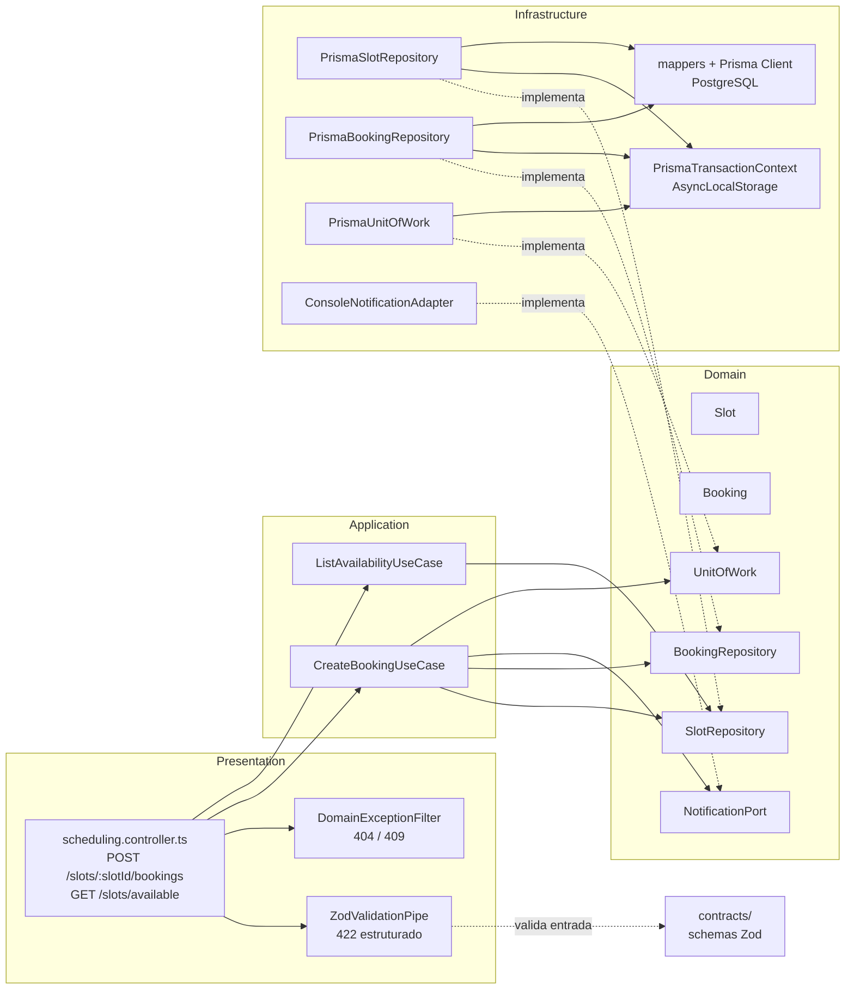
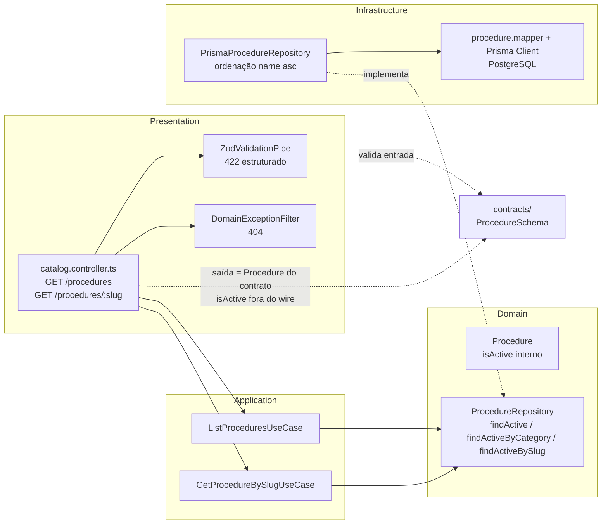

# C3 — Diagrama de Componentes — Frontend (real)

Componentes existentes do frontend (`frontend/`). O backend será detalhado por módulo quando implementado.

```mermaid
flowchart LR
    subgraph Rotas
        R1[/]
        R2[/tratamentos/]
        R3[/tratamentos/[slug]/]
        R4[/sobre/]
        R5[/antes-depois/]
        R6[/depoimentos/]
        R7[/orcamento/]
        R8[/contato/]
        R9[/blog/]
        R10[/blog/[slug]/]
        APP[app/<br/>rotas e páginas]
    end
    subgraph UI
        COMP[components/<br/>reutilizáveis]
        HOME[features/home/]
        CAT[features/catalog/]
        ABOUT[features/about/]
        RES[features/results/<br/>página antes-depois/]
        TEST[features/testimonials/<br/>página depoimentos/]
        QUO[features/quote/<br/>página orçamento/]
        CONT[features/contact/<br/>página contato/]
        BLOG[features/blog/<br/>páginas blog/]
        BOOK[features/booking/<br/>modal/]
    end
    subgraph Dados
        LIB[lib/<br/>interfaces + mocks + acesso]
    end
    subgraph Estilo
        STY[styles/<br/>tokens]
    end
    R1 --> HOME
    R2 --> CAT
    R3 --> CAT
    R4 --> ABOUT
    R5 --> RES
    R6 --> TEST
    R7 --> QUO
    R8 --> CONT
    R9 --> BLOG
    R10 --> BLOG
    APP --> HOME
    APP --> CAT
    APP --> ABOUT
    APP --> RES
    APP --> TEST
    APP --> QUO
    APP --> CONT
    APP --> BLOG
    APP --> COMP
    HOME --> COMP
    CAT --> COMP
    ABOUT --> COMP
    RES --> COMP
    TEST --> COMP
    QUO --> BOOK
    CONT --> BOOK
    BLOG --> BOOK
    BOOK --> LIB
    HOME --> LIB
    CAT --> LIB
    ABOUT --> LIB
    RES --> LIB
    TEST --> LIB
    QUO --> LIB
    CONT --> LIB
    BLOG --> LIB
    COMP --> STY
    HOME --> STY
    CAT --> STY
    ABOUT --> STY
    RES --> STY
    TEST --> STY
    QUO --> STY
    CONT --> STY
    BLOG --> STY
```

- Pastas verificadas no repositório: `app/` (com `/`, `/tratamentos`, `/tratamentos/[slug]`, `/sobre`, `/antes-depois`, `/depoimentos`, `/orcamento`, `/contato`, `/blog`, `/blog/[slug]`), `components/` (incluindo o comparador antes/depois e o filtro de categoria compartilhados), `features/` (`home`, `catalog`, `about`, `booking`, `results`, `testimonials`, `quote`, `contact`, `blog`), `lib/` (interfaces + mocks + acesso + helpers de domínio, ex. iniciais, contratos e submissões de orçamento e contato, busca e data do blog), `styles/`.
- Regra: componentes consomem `lib/` via interfaces; trocar mocks pela API altera só `lib/`.

## Backend (real — módulo Agendamento)

Primeiro módulo do backend, em Clean Architecture com TDD por camada (`docs/engineering/07-workflow-de-engenharia.md` §15). Regra de dependência verificada: `domain/` não importa nada de fora; `application/` só depende de `domain/`; `infrastructure/` implementa as portas do `domain/`; `presentation/` depende de `application/`.



- Pastas verificadas: `backend/src/scheduling/` com `domain/` (entidades `Slot`/`Booking`, erros e portas), `application/use-cases/` (dois casos de uso), `infrastructure/` (repos Prisma, mappers, `PrismaUnitOfWork`, `PrismaTransactionContext`, adapter de notificação) e `presentation/` (controller, pipe Zod, filtro de domínio).
- **Wiring:** `SchedulingModule` registra o `PrismaTransactionContext` como provider **singleton** compartilhado entre a `UnitOfWork` e os repositórios — a propagação do client transacional via `AsyncLocalStorage` depende dessa instância única (há teste-canário de write-then-throw contra os providers reais do módulo).
- **Sem Keycloak ainda:** o módulo não tem autenticação (Feature 4.2 de Identidade e Acesso).

## Backend (real — módulo Catálogo)

Segundo módulo do backend, mesma Clean Architecture com TDD por camada (`docs/engineering/07-workflow-de-engenharia.md` §15). Recorte desta entrega: **leitura pública** (o CRUD administrativo do UC 4.2.2 nasce com Identidade e Acesso). Regra de dependência verificada: `domain/` não importa nada de fora; `application/` só depende de `domain/`; `infrastructure/` implementa as portas do `domain/`; `presentation/` depende de `application/`.



- Pastas verificadas: `backend/src/catalog/` com `domain/` (entidade `Procedure`, erros locais, porta de leitura), `application/use-cases/` (dois casos de uso), `infrastructure/persistence/` (repositório Prisma + mapper) e `presentation/` (controller, pipe Zod e filtro de domínio **locais do módulo** — bounded contexts não compartilham apresentação).
- **Wiring:** `CatalogModule` cria o próprio `PrismaClient` (trade-off dos dois pools registrado no módulo; candidato a provider compartilhado quando o 3º módulo chegar). Sem `UnitOfWork`: leitura de entidade única não precisa de transação.
- **Sem Keycloak ainda:** leitura pública por desenho (UC 4.2.2); a escrita nasce com Identidade e Acesso.

## Backend (real — módulo Conteúdo Público)

Terceiro módulo do backend, mesma Clean Architecture com TDD por camada (`docs/engineering/07-workflow-de-engenharia.md` §15). Recorte desta entrega: **leitura pública** (o CRUD administrativo e a gestão de consentimento do UC 4.2.7 nascem com Identidade e Acesso). Invariante central: **nada sem consentimento é servido publicamente** (`docs/security/03-seguranca.md` §5), garantida em três camadas independentes. Regra de dependência verificada: `domain/` não importa nada de fora; `application/` só depende de `domain/`; `infrastructure/` implementa as portas do `domain/`; `presentation/` depende de `application/`.

```mermaid
flowchart LR
    subgraph Presentation
        CTRL[content.controller.ts<br/>GET /testimonials<br/>GET /posts<br/>GET /posts/:slug<br/>GET /before-after]
        PIPE[ZodValidationPipe<br/>422 estruturado]
        FILTER[DomainExceptionFilter<br/>404]
    end
    subgraph Application
        UC1[ListTestimonialsUseCase]
        UC2[ListPostsUseCase]
        UC3[GetPostBySlugUseCase]
        UC4[ListBeforeAfterUseCase]
    end
    subgraph Domain
        E1[Testimonial]
        E2[Post]
        E3[BeforeAfterCase<br/>hasConsent fail-closed]
        P1[TestimonialRepository<br/>findAll]
        P2[PostRepository<br/>findAll / findBySlug]
        P3[BeforeAfterCaseRepository<br/>findConsented]
    end
    subgraph Infrastructure
        R1[PrismaTestimonialRepository<br/>ordenação id asc]
        R2[PrismaPostRepository<br/>publishedAt desc]
        R3[PrismaBeforeAfterCaseRepository<br/>where hasConsent true]
        MAP[mappers + Prisma Client<br/>PostgreSQL]
    end
    CONTRACTS[contracts/<br/>TestimonialSchema / PostSchema<br/>PublicBeforeAfterListSchema]
    CTRL --> PIPE
    CTRL --> FILTER
    CTRL --> UC1
    CTRL --> UC2
    CTRL --> UC3
    CTRL --> UC4
    PIPE -.->|valida entrada| CONTRACTS
    CTRL -.->|saída validada contra o contrato<br/>hasConsent literal true (fail-closed)| CONTRACTS
    UC1 --> P1
    UC2 --> P2
    UC3 --> P2
    UC4 --> P3
    R1 -.->|implementa| P1
    R2 -.->|implementa| P2
    R3 -.->|implementa| P3
    R1 --> MAP
    R2 --> MAP
    R3 --> MAP
```

- Pastas verificadas: `backend/src/content/` com `domain/` (entidades `Testimonial`/`Post`/`BeforeAfterCase`, erros locais, três portas de leitura), `application/use-cases/` (quatro casos de uso), `infrastructure/persistence/` (três repositórios Prisma + mappers) e `presentation/` (controller, pipe Zod e filtro de domínio **locais do módulo**).
- **Invariante de consentimento em três camadas:** (1) banco — `hasConsent Boolean @default(false)` (fail-closed); (2) query — `findConsented` usa `where: { hasConsent: true }`; (3) saída — `PublicBeforeAfterListSchema.parse` com `hasConsent: z.literal(true)` no controller. Provada por teste HTTP dedicado com negação deliberada (write-then-throw): sem o filtro, o caso sem consentimento aparece na resposta e o teste reprova; a camada 3 sozinha falha fechada (500, sem vazar).
- **Wiring:** `ContentModule` cria o próprio `PrismaClient` (terceiro pool conscientemente adiado — design decisão 8; provider compartilhado vira change próprio no 4º módulo ou sob pressão observada). Sem `UnitOfWork`: leitura de entidade única não precisa de transação.
- **Sem Keycloak ainda:** leitura pública por desenho (UC 4.2.7); escrita/CRUD e gestão de consentimento nascem com Identidade e Acesso. O contrato vigente não tem campos de imagem nem PII (fotos binárias são escopo futuro explícito).

## Backend (placeholder normatizado)

Quando cada módulo for implementado, detalhar aqui suas camadas — Domain, Application, Infrastructure, Presentation (`docs/02-arquitetura.md` §7) — módulo a módulo, não antes.

> Este diagrama deve ser atualizado como parte do Verify de qualquer Change que altere sua camada.
