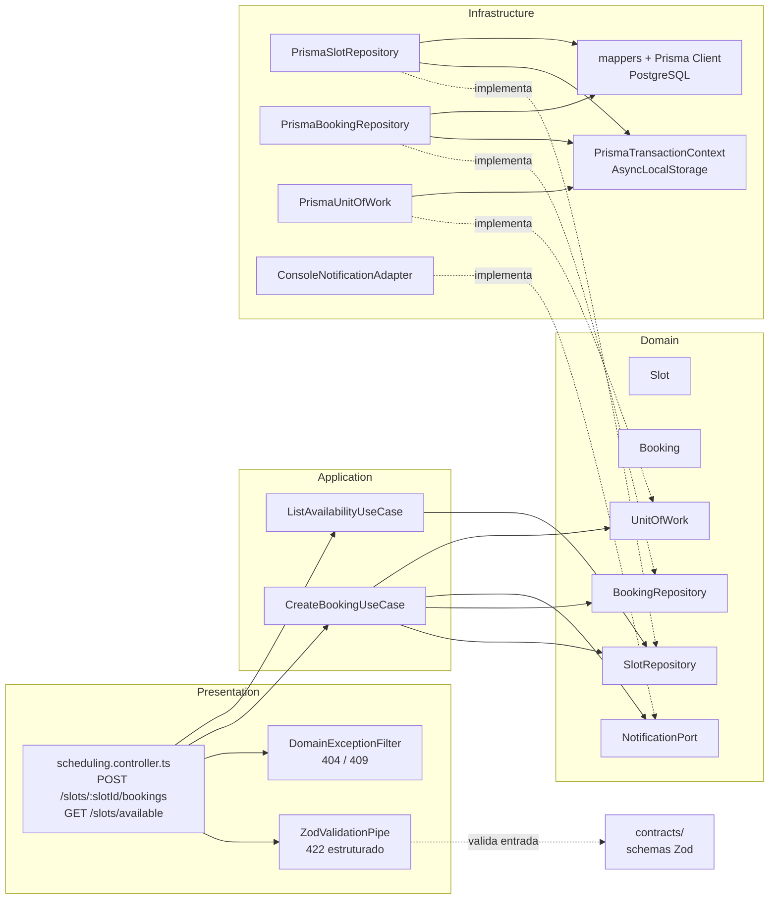
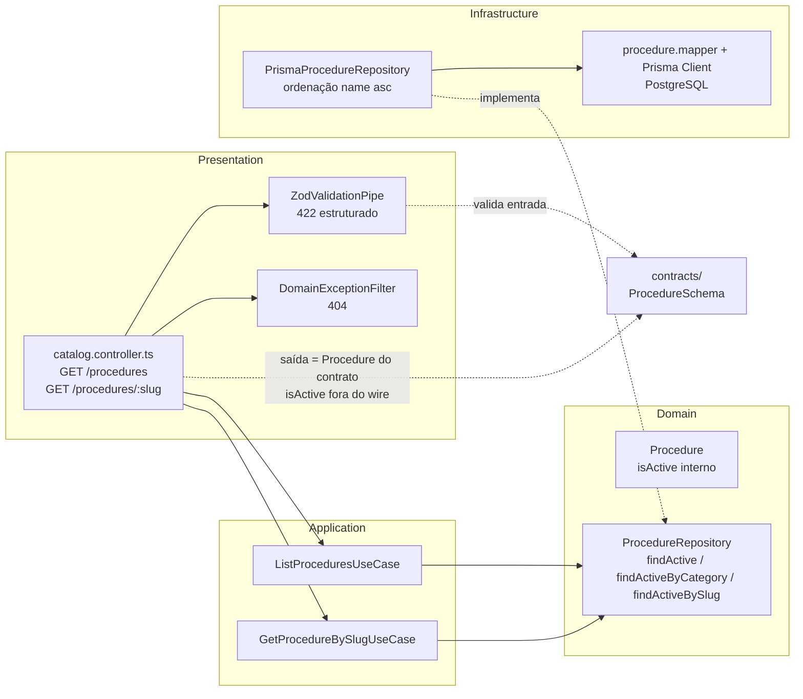
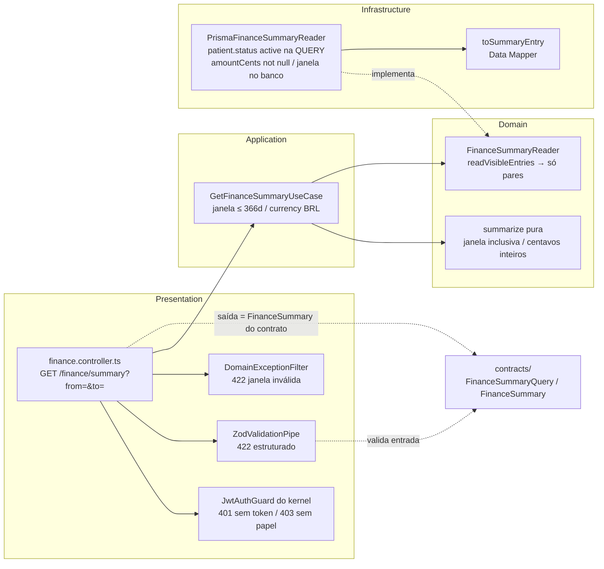
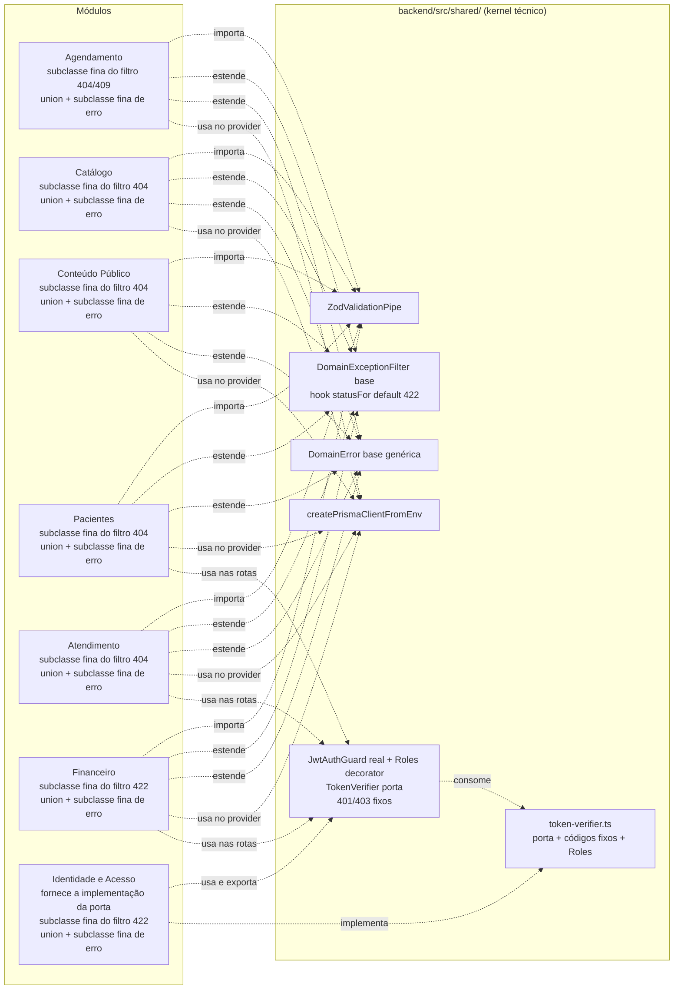

# C3 — Diagrama de Componentes — Frontend (real)

Componentes existentes do frontend (`frontend/`). O backend será detalhado por módulo quando implementado.

```mermaid
flowchart LR
    subgraph Rotas
        R1[/]
        R2[/tratamentos/]
        R3[/tratamentos/[slug]/]
        R4[/sobre/]
        R5[/antes-depois/]
        R6[/depoimentos/]
        R7[/orcamento/]
        R8[/contato/]
        R9[/blog/]
        R10[/blog/[slug]/]
        APP[app/<br/>rotas e páginas]
    end
    subgraph UI
        COMP[components/<br/>reutilizáveis]
        HOME[features/home/]
        CAT[features/catalog/]
        ABOUT[features/about/]
        RES[features/results/<br/>página antes-depois/]
        TEST[features/testimonials/<br/>página depoimentos/]
        QUO[features/quote/<br/>página orçamento/]
        CONT[features/contact/<br/>página contato/]
        BLOG[features/blog/<br/>páginas blog/]
        BOOK[features/booking/<br/>modal/]
    end
    subgraph Dados
        LIB[lib/<br/>interfaces + mocks + acesso]
    end
    subgraph Estilo
        STY[styles/<br/>tokens]
    end
    R1 --> HOME
    R2 --> CAT
    R3 --> CAT
    R4 --> ABOUT
    R5 --> RES
    R6 --> TEST
    R7 --> QUO
    R8 --> CONT
    R9 --> BLOG
    R10 --> BLOG
    APP --> HOME
    APP --> CAT
    APP --> ABOUT
    APP --> RES
    APP --> TEST
    APP --> QUO
    APP --> CONT
    APP --> BLOG
    APP --> COMP
    HOME --> COMP
    CAT --> COMP
    ABOUT --> COMP
    RES --> COMP
    TEST --> COMP
    QUO --> BOOK
    CONT --> BOOK
    BLOG --> BOOK
    BOOK --> LIB
    HOME --> LIB
    CAT --> LIB
    ABOUT --> LIB
    RES --> LIB
    TEST --> LIB
    QUO --> LIB
    CONT --> LIB
    BLOG --> LIB
    COMP --> STY
    HOME --> STY
    CAT --> STY
    ABOUT --> STY
    RES --> STY
    TEST --> STY
    QUO --> STY
    CONT --> STY
    BLOG --> STY
```

- Pastas verificadas no repositório: `app/` (com `/`, `/tratamentos`, `/tratamentos/[slug]`, `/sobre`, `/antes-depois`, `/depoimentos`, `/orcamento`, `/contato`, `/blog`, `/blog/[slug]`), `components/` (incluindo o comparador antes/depois e o filtro de categoria compartilhados), `features/` (`home`, `catalog`, `about`, `booking`, `results`, `testimonials`, `quote`, `contact`, `blog`), `lib/` (interfaces + mocks + acesso + helpers de domínio, ex. iniciais, contratos e submissões de orçamento e contato, busca e data do blog), `styles/`.
- Regra: componentes consomem `lib/` via interfaces; trocar mocks pela API altera só `lib/`.

## Backend (real — módulo Agendamento)

Primeiro módulo do backend, em Clean Architecture com TDD por camada (`docs/engineering/07-workflow-de-engenharia.md` §15). Regra de dependência verificada: `domain/` não importa nada de fora; `application/` só depende de `domain/`; `infrastructure/` implementa as portas do `domain/`; `presentation/` depende de `application/`.

```mermaid
flowchart LR
    subgraph Presentation
        CTRL[scheduling.controller.ts<br/>POST /slots/:slotId/bookings<br/>GET /slots/available]
        PIPE[ZodValidationPipe<br/>422 estruturado]
        FILTER[DomainExceptionFilter<br/>404 / 409]
    end
    subgraph Application
        UC1[CreateBookingUseCase]
        UC2[ListAvailabilityUseCase]
    end
    subgraph Domain
        E1[Slot]
        E2[Booking]
        P1[SlotRepository]
        P2[BookingRepository]
        P3[NotificationPort]
        P4[UnitOfWork]
    end
    subgraph Infrastructure
        R1[PrismaSlotRepository]
        R2[PrismaBookingRepository]
        UOW[PrismaUnitOfWork]
        CTX[PrismaTransactionContext<br/>AsyncLocalStorage]
        NOTIF[ConsoleNotificationAdapter]
        MAP[mappers + Prisma Client<br/>PostgreSQL]
    end
    CONTRACTS[contracts/<br/>schemas Zod]
    CTRL --> PIPE
    CTRL --> FILTER
    CTRL --> UC1
    CTRL --> UC2
    PIPE -.->|valida entrada| CONTRACTS
    UC1 --> P1
    UC1 --> P2
    UC1 --> P3
    UC1 --> P4
    UC2 --> P1
    R1 -.->|implementa| P1
    R2 -.->|implementa| P2
    UOW -.->|implementa| P4
    NOTIF -.->|implementa| P3
    R1 --> CTX
    R2 --> CTX
    UOW --> CTX
    R1 --> MAP
    R2 --> MAP
```

- Pastas verificadas: `backend/src/scheduling/` com `domain/` (entidades `Slot`/`Booking`, erros e portas), `application/use-cases/` (dois casos de uso), `infrastructure/` (repos Prisma, mappers, `PrismaUnitOfWork`, `PrismaTransactionContext`, adapter de notificação) e `presentation/` (controller, pipe Zod, filtro de domínio).
- **Wiring:** `SchedulingModule` registra o `PrismaTransactionContext` como provider **singleton** compartilhado entre a `UnitOfWork` e os repositórios — a propagação do client transacional via `AsyncLocalStorage` depende dessa instância única (há teste-canário de write-then-throw contra os providers reais do módulo).
- **Sem Keycloak ainda:** o módulo não tem autenticação (Feature 4.2 de Identidade e Acesso).

## Backend (real — módulo Catálogo)

Segundo módulo do backend, mesma Clean Architecture com TDD por camada (`docs/engineering/07-workflow-de-engenharia.md` §15). Recorte desta entrega: **leitura pública** (o CRUD administrativo do UC 4.2.2 nasce com Identidade e Acesso). Regra de dependência verificada: `domain/` não importa nada de fora; `application/` só depende de `domain/`; `infrastructure/` implementa as portas do `domain/`; `presentation/` depende de `application/`.

```mermaid
flowchart LR
    subgraph Presentation
        CTRL[catalog.controller.ts<br/>GET /procedures<br/>GET /procedures/:slug]
        PIPE[ZodValidationPipe<br/>422 estruturado]
        FILTER[DomainExceptionFilter<br/>404]
    end
    subgraph Application
        UC1[ListProceduresUseCase]
        UC2[GetProcedureBySlugUseCase]
    end
    subgraph Domain
        E1[Procedure<br/>isActive interno]
        P1[ProcedureRepository<br/>findActive / findActiveByCategory / findActiveBySlug]
    end
    subgraph Infrastructure
        R1[PrismaProcedureRepository<br/>ordenação name asc]
        MAP[procedure.mapper + Prisma Client<br/>PostgreSQL]
    end
    CONTRACTS[contracts/<br/>ProcedureSchema]
    CTRL --> PIPE
    CTRL --> FILTER
    CTRL --> UC1
    CTRL --> UC2
    PIPE -.->|valida entrada| CONTRACTS
    CTRL -.->|saída = Procedure do contrato<br/>isActive fora do wire| CONTRACTS
    UC1 --> P1
    UC2 --> P1
    R1 -.->|implementa| P1
    R1 --> MAP
```

- Pastas verificadas: `backend/src/catalog/` com `domain/` (entidade `Procedure`, erros locais, porta de leitura), `application/use-cases/` (dois casos de uso), `infrastructure/persistence/` (repositório Prisma + mapper) e `presentation/` (controller, pipe Zod e filtro de domínio **locais do módulo** — bounded contexts não compartilham apresentação).
- **Wiring:** `CatalogModule` cria o próprio `PrismaClient` (trade-off dos dois pools registrado no módulo; candidato a provider compartilhado quando o 3º módulo chegar). Sem `UnitOfWork`: leitura de entidade única não precisa de transação.
- **Sem Keycloak ainda:** leitura pública por desenho (UC 4.2.2); a escrita nasce com Identidade e Acesso.

## Backend (real — módulo Conteúdo Público)

Terceiro módulo do backend, mesma Clean Architecture com TDD por camada (`docs/engineering/07-workflow-de-engenharia.md` §15). Recorte desta entrega: **leitura pública** (o CRUD administrativo e a gestão de consentimento do UC 4.2.7 nascem com Identidade e Acesso). Invariante central: **nada sem consentimento é servido publicamente** (`docs/security/03-seguranca.md` §5), garantida em três camadas independentes. Regra de dependência verificada: `domain/` não importa nada de fora; `application/` só depende de `domain/`; `infrastructure/` implementa as portas do `domain/`; `presentation/` depende de `application/`.

```mermaid
flowchart LR
    subgraph Presentation
        CTRL[content.controller.ts<br/>GET /testimonials<br/>GET /posts<br/>GET /posts/:slug<br/>GET /before-after]
        PIPE[ZodValidationPipe<br/>422 estruturado]
        FILTER[DomainExceptionFilter<br/>404]
    end
    subgraph Application
        UC1[ListTestimonialsUseCase]
        UC2[ListPostsUseCase]
        UC3[GetPostBySlugUseCase]
        UC4[ListBeforeAfterUseCase]
    end
    subgraph Domain
        E1[Testimonial]
        E2[Post]
        E3[BeforeAfterCase<br/>hasConsent fail-closed]
        P1[TestimonialRepository<br/>findAll]
        P2[PostRepository<br/>findAll / findBySlug]
        P3[BeforeAfterCaseRepository<br/>findConsented]
    end
    subgraph Infrastructure
        R1[PrismaTestimonialRepository<br/>ordenação id asc]
        R2[PrismaPostRepository<br/>publishedAt desc]
        R3[PrismaBeforeAfterCaseRepository<br/>where hasConsent true]
        MAP[mappers + Prisma Client<br/>PostgreSQL]
    end
    CONTRACTS[contracts/<br/>TestimonialSchema / PostSchema<br/>PublicBeforeAfterListSchema]
    CTRL --> PIPE
    CTRL --> FILTER
    CTRL --> UC1
    CTRL --> UC2
    CTRL --> UC3
    CTRL --> UC4
    PIPE -.->|valida entrada| CONTRACTS
    CTRL -.->|saída validada contra o contrato<br/>hasConsent literal true (fail-closed)| CONTRACTS
    UC1 --> P1
    UC2 --> P2
    UC3 --> P2
    UC4 --> P3
    R1 -.->|implementa| P1
    R2 -.->|implementa| P2
    R3 -.->|implementa| P3
    R1 --> MAP
    R2 --> MAP
    R3 --> MAP
```

- Pastas verificadas: `backend/src/content/` com `domain/` (entidades `Testimonial`/`Post`/`BeforeAfterCase`, erros locais, três portas de leitura), `application/use-cases/` (quatro casos de uso), `infrastructure/persistence/` (três repositórios Prisma + mappers) e `presentation/` (controller, pipe Zod e filtro de domínio **locais do módulo**).
- **Invariante de consentimento em três camadas:** (1) banco — `hasConsent Boolean @default(false)` (fail-closed); (2) query — `findConsented` usa `where: { hasConsent: true }`; (3) saída — `PublicBeforeAfterListSchema.parse` com `hasConsent: z.literal(true)` no controller. Provada por teste HTTP dedicado com negação deliberada (write-then-throw): sem o filtro, o caso sem consentimento aparece na resposta e o teste reprova; a camada 3 sozinha falha fechada (500, sem vazar).
- **Wiring:** `ContentModule` cria o próprio `PrismaClient` (terceiro pool conscientemente adiado — design decisão 8; provider compartilhado vira change próprio no 4º módulo ou sob pressão observada). Sem `UnitOfWork`: leitura de entidade única não precisa de transação.
- **Sem Keycloak ainda:** leitura pública por desenho (UC 4.2.7); escrita/CRUD e gestão de consentimento nascem com Identidade e Acesso. O contrato vigente não tem campos de imagem nem PII (fotos binárias são escopo futuro explícito).

## Backend (real — módulo Pacientes)

Quarto módulo do backend, mesma Clean Architecture com TDD por camada (`docs/engineering/07-workflow-de-engenharia.md` §15). Recorte desta entrega: **CRUD administrativo com PII mínima** — o contrato nasceu do zero em `contracts/src/patients/` (contexto sem mock no frontend). Estrutura dos direitos do titular (LGPD) já operante: anonimização via delete e visibilidade na query. **Autenticação real desde o change `backend-modulo-identidade`:** guard do kernel com JWT do Keycloak (401 sem token) e RBAC — leitura para `admin`/`reception`; escrita e anonimização só `admin` (403 idêntico para papel ausente/insuficiente). Sem `UnitOfWork`: escrita de entidade única.

```mermaid
flowchart LR
    subgraph Presentation
        GUARD[JwtAuthGuard do kernel<br/>401 sem token / 403 sem papel<br/>RBAC: leitura admin+reception; escrita admin]
        CTRL[patients.controller.ts<br/>POST /patients<br/>GET /patients[?limit]<br/>GET /patients/:id<br/>PATCH /patients/:id<br/>DELETE /patients/:id]
        PIPE[ZodValidationPipe<br/>422 estruturado]
        FILTER[DomainExceptionFilter<br/>404]
    end
    subgraph Application
        UC1[CreatePatientUseCase]
        UC2[ListPatientsUseCase<br/>default 100 / teto 500]
        UC3[GetPatientByIdUseCase]
        UC4[UpdatePatientUseCase]
        UC5[AnonymizePatientUseCase]
    end
    subgraph Domain
        E1[Patient<br/>anonymize: placeholders fixos<br/>status active/anonymized]
        P1[PatientRepository<br/>save / findVisible limit / findVisibleById]
    end
    subgraph Infrastructure
        R1[PrismaPatientRepository<br/>where status active na QUERY<br/>take limit / ordem nome,id]
        MAP[patient.mapper + Prisma Client<br/>PostgreSQL]
    end
    CONTRACTS[contracts/<br/>PatientInput / PatientUpdate / Patient]
    CTRL --> GUARD
    CTRL --> PIPE
    CTRL --> FILTER
    CTRL --> UC1
    CTRL --> UC2
    CTRL --> UC3
    CTRL --> UC4
    CTRL --> UC5
    PIPE -.->|valida entrada| CONTRACTS
    CTRL -.->|saída = Patient do contrato<br/>timestamps ISO, anonymizedAt fora do wire| CONTRACTS
    UC1 --> P1
    UC2 --> P1
    UC3 --> P1
    UC4 --> P1
    UC5 --> P1
    R1 -.->|implementa| P1
    R1 --> MAP
```

- Pastas verificadas: `backend/src/patients/` com `domain/` (entidade `Patient` com `anonymize`, erros locais, porta única), `application/use-cases/` (cinco casos de uso), `infrastructure/persistence/` (repositório Prisma + mapper) e `presentation/` (controller, guard honesto, pipe/filtro locais).
- **Direitos do titular (estrutura operante):** `DELETE` **anonimiza** — PII vira placeholders fixos, `status`/`anonymizedAt` carimbados; o registro sai de todas as leituras visíveis (filtro na query) e id anonimizado responde 404 idêntico ao inexistente. Prova por write-then-throw no `verification.md` do change.
- **PII mínima:** contrato sem e-mail, sem campo livre de observações e sem qualquer campo clínico; finalidade registrada por registro (LGPD, 03 §4); nenhum log de payload.
- **Autenticação real:** `JwtAuthGuard` do kernel (verificação via `IdentityModule`) — sem token válido `AUTH_UNAUTHENTICATED` (401), sem papel `AUTH_FORBIDDEN` (403), respostas fixas e idênticas por classe; as guard-specs provam o contraste (sem token = 401/403 × token válido com papel = acesso), substituindo o `overrideGuard` do bloqueio honesto (change `backend-modulo-identidade`).
- **Wiring:** `PatientsModule` com cliente próprio (factory do kernel compartilhado; quarto pool adiado como decisão consciente) e guard nos providers; wireado no `AppModule`.

## Backend (real — módulo Atendimento/Histórico)

Quinto módulo do backend, mesma Clean Architecture com TDD por camada (`docs/engineering/07-workflow-de-engenharia.md` §15). Recorte desta entrega: **registro e leitura do histórico simples por paciente** (UC 4.2.5) — histórico **imutável** (sem update/delete; correção por novo registro) e **sem prontuário**: `summary` é texto operacional opaco, com teto de 500, sem campo clínico dedicado. Contrato novo em `contracts/src/attendance/` (contexto sem mock no frontend). **Visibilidade herdada do paciente:** primeiro join com Pacientes, respeitando a dívida R3 — porta `PatientDirectory` (leitura cruzada explícita, sem importar o domínio de Pacientes) + filtro de relação na query; histórico de anonimizada nunca é servido (prova write-then-throw em duas camadas no `verification.md`). **Autenticação real desde o change `backend-modulo-identidade`:** guard do kernel com JWT do Keycloak (401 sem token) e RBAC operacional `admin`/`reception`. Sem `UnitOfWork`: escrita de entidade única.

```mermaid
flowchart LR
    subgraph Presentation
        GUARD[JwtAuthGuard do kernel<br/>401 sem token / 403 sem papel]
        CTRL[attendances.controller.ts<br/>POST /patients/:patientId/attendances<br/>GET /patients/:patientId/attendances[?limit]<br/>GET /patients/:patientId/attendances/:id]
        PIPE[ZodValidationPipe<br/>422 estruturado]
        FILTER[DomainExceptionFilter<br/>404 paciente/atendimento]
    end
    subgraph Application
        UC1[CreateAttendanceUseCase<br/>paciente visível obrigatória]
        UC2[ListAttendancesUseCase<br/>default 100 / teto 500]
        UC3[GetAttendanceByIdUseCase<br/>pertencimento no detalhe]
    end
    subgraph Domain
        E1[Attendance<br/>imutável / summary máx 500<br/>sem update e sem delete]
        P1[AttendanceRepository<br/>save / findVisibleByPatient / findVisibleById]
        P2[PatientDirectory<br/>findVisiblePatient → só o vínculo]
    end
    subgraph Infrastructure
        R1[PrismaAttendanceRepository<br/>patient.status active na QUERY<br/>ordem data desc, id asc / take limit]
        R2[PrismaPatientDirectory<br/>where id + status active / select id]
        MAP[mappers + Prisma Client<br/>PostgreSQL / FK para Patient]
    end
    CONTRACTS[contracts/<br/>AttendanceInput / Attendance]
    CTRL --> GUARD
    CTRL --> PIPE
    CTRL --> FILTER
    CTRL --> UC1
    CTRL --> UC2
    CTRL --> UC3
    PIPE -.->|valida entrada| CONTRACTS
    CTRL -.->|saída = Attendance do contrato<br/>timestamps ISO, sem nome de paciente| CONTRACTS
    UC1 --> P1
    UC1 --> P2
    UC2 --> P1
    UC2 --> P2
    UC3 --> P1
    UC3 --> P2
    R1 -.->|implementa| P1
    R2 -.->|implementa| P2
    R1 --> MAP
    R2 --> MAP
```

- Pastas verificadas: `backend/src/attendance/` com `domain/` (entidade `Attendance` imutável, erros locais, portas `AttendanceRepository` e `PatientDirectory`), `application/use-cases/` (três casos de uso), `infrastructure/persistence/` (repositório Prisma + adapter da porta de Pacientes + mapper) e `presentation/` (controller, pipe/filtro locais).
- **Imutabilidade:** a entidade não expõe update/delete; a API não expõe PATCH/PUT/DELETE (rota não encontrada) — provado em teste; a exclusão de dados pessoais acontece na paciente (anonimização).
- **PII mínima:** nenhum snapshot de nome no histórico (só FK); a porta de Pacientes seleciona apenas o vínculo; nenhum log de payload. `summary` é dado opaco — nunca interpretado (injeção/unicode preservados literalmente, testado).
- **Autenticação real:** `JwtAuthGuard` do kernel — sem token válido 401, sem papel 403 (idêntico para ausente/insuficiente); `admin` e `reception` operam o histórico (change `backend-modulo-identidade`, com as suítes convertidas como caracterização).
- **Wiring:** `AttendanceModule` com cliente próprio (factory do kernel compartilhado; quinto pool adiado como decisão consciente) e guard nos providers; wireado no `AppModule`.

## Backend (real — módulo Financeiro)

Sexto módulo do backend, mesma Clean Architecture com TDD por camada (`docs/engineering/07-workflow-de-engenharia.md` §15). Recorte desta entrega: **resumo financeiro essencial por janela** (UC 4.2.6) — `GET /finance/summary?from=&to=` (janela obrigatória, teto de 366 dias), só leitura, agregado **sem PII e sem breakdown por construção** (a resposta não tem campo para vazar). O valor mora no Atendimento como `amountCents` opcional (centavos inteiros, teto de R$ 100.000, imutável depois de criado — sem entidade de cobrança e sem preço no catálogo). **Visibilidade herdada no agregado:** o reader filtra a relação `patient: { status: "active" }` na query; valor de paciente anonimizada nunca compõe total/contagem (prova write-then-throw no `verification.md`). **Autenticação real desde o change `backend-modulo-identidade`:** guard do kernel com JWT do Keycloak (401 sem token) e RBAC **`admin`-only**. Sem `UnitOfWork` (só leitura) e cliente Prisma próprio (sexto pool consciente; factory do kernel).

```mermaid
flowchart LR
    subgraph Presentation
        GUARD[JwtAuthGuard do kernel<br/>401 sem token / 403 sem papel]
        CTRL[finance.controller.ts<br/>GET /finance/summary?from=&to=]
        PIPE[ZodValidationPipe<br/>422 estruturado]
        FILTER[DomainExceptionFilter<br/>422 janela inválida]
    end
    subgraph Application
        UC[GetFinanceSummaryUseCase<br/>janela ≤ 366d / currency BRL]
    end
    subgraph Domain
        S[summarize pura<br/>janela inclusiva / centavos inteiros]
        P[FinanceSummaryReader<br/>readVisibleEntries → só pares]
    end
    subgraph Infrastructure
        R[PrismaFinanceSummaryReader<br/>patient.status active na QUERY<br/>amountCents not null / janela no banco]
        MAP[toSummaryEntry<br/>Data Mapper]
    end
    CONTRACTS[contracts/<br/>FinanceSummaryQuery / FinanceSummary]
    CTRL --> GUARD
    CTRL --> PIPE
    CTRL --> FILTER
    CTRL --> UC
    PIPE -.->|valida entrada| CONTRACTS
    CTRL -.->|saída = FinanceSummary do contrato| CONTRACTS
    UC --> S
    UC --> P
    R -.->|implementa| P
    R --> MAP
```

- Pastas verificadas: `backend/src/finance/` com `domain/` (`summarize` pura + erros locais + porta `FinanceSummaryReader`), `application/use-cases/` (caso de uso do resumo), `infrastructure/persistence/` (reader Prisma + mapper) e `presentation/` (controller, pipe/filtro locais).
- **Agregado sem PII:** a porta devolve apenas `{ amountCents, performedAt }`; o mapper não materializa nome/vínculo/resumo; a resposta tem exatamente janela/moeda/total/contagem (auditado por inspeção e por chaves exatas nos testes).
- **Centavos inteiros:** sem float; teto de entrada espelhado no contrato (assertado); soma de 100 mil registros no teto permanece inteira e segura.
- **Autenticação real:** `JwtAuthGuard` do kernel — sem token válido 401, sem papel (ou `reception`) 403 byte-idêntico; só `admin` alcança o agregado (change `backend-modulo-identidade`).
- **Wiring:** `FinanceModule` com cliente próprio (factory do kernel compartilhado; sexto pool adiado como decisão consciente), sem `UnitOfWork`; wireado no `AppModule`.

## Backend (real — módulo Identidade e Acesso)

Sétimo módulo do backend, mesma Clean Architecture com TDD por camada (`docs/engineering/07-workflow-de-engenharia.md` §15). Recorte desta entrega (UC 4.2.1): **autenticação real via Keycloak, sem endpoint de login próprio** — o backend valida o JWT (assinatura via JWKS com cache de 10 min, emissor, audiência, expiração com tolerância de 30 s e allowlist `RS256`) e aplica **RBAC com negação por padrão**. O guard vive no kernel; a implementação da porta `TokenVerifier` vive aqui. **2FA** exigido no realm versionado (fluxo com OTP obrigatório + `CONFIGURE_TOTP`) e provado contra o Keycloak real. Erros fixos por classe: 401 `AUTH_UNAUTHENTICATED` (todas as falhas de autenticação) e 403 `AUTH_FORBIDDEN` (sem papel × papel insuficiente, byte-idênticos), sem eco de motivo.

```mermaid
flowchart LR
    subgraph Presentation
        GUARD[JwtAuthGuard do kernel<br/>401/403 fixos + Roles]
    end
    subgraph Application
        UC[AuthenticateUseCase<br/>entrada inválida nem toca a porta]
    end
    subgraph Domain
        ROLES[roles: admin / reception<br/>vocabulário fechado]
        CLAIMS[fromTokenClaims<br/>claims → identidade, sem TypeError]
        AUTHZ[isAuthorized<br/>negação por padrão]
        P[TokenValidator porta<br/>validate → identidade ou nulo]
    end
    subgraph Infrastructure
        JOSE[JoseTokenValidator<br/>jose + JWKS (cache/cooldown)<br/>allowlist RS256 / clockTolerance 30s]
        CONFIG[createJoseTokenValidatorFromEnv<br/>KEYCLOAK_ISSUER/AUDIENCE → JWKS]
    end
    REALLM[Keycloak real<br/>realm versionado + 2FA]
    GUARD --> UC
    UC --> P
    P -.->|implementa| JOSE
    JOSE --> CONFIG
    JOSE -.->|valida tokens| REALLM
    UC --> CLAIMS
    GUARD --> AUTHZ
    CLAIMS --> ROLES
    AUTHZ --> ROLES
```

- Pastas verificadas: `backend/src/identity/` com `domain/` (papéis, claims, autorização e porta `TokenValidator` — sem imports externos/cruzados), `application/use-cases/` (autenticação contra a porta), `infrastructure/` (validador jose + configuração por ambiente) e `identity.module.ts` (providers por token; exporta `TokenVerifier` e o guard).
- **Sem login próprio:** nenhum endpoint de emissão/renovação de token no backend; o fluxo padrão do Keycloak no frontend é o Épico 5.
- **Falha fechado:** qualquer falha de token vira 401 idêntico; falha inesperada do validador também (o guard nunca propaga detalhe interno); `reception`/`admin` são o vocabulário fechado de papéis — papel desconhecido no token é filtrado.
- **Testes com JWKS fake (design decisão 3):** unit/integração assinam tokens de verdade contra um JWKS local (cache, rotação e queda provados); a prova de 2FA roda contra o Keycloak do compose e é pulada no CI com motivo visível (o pipeline não sobe Keycloak).

## Backend (kernel técnico compartilhado)

Plumbing puro compartilhado entre os módulos, em exceção explícita à regra de bounded contexts não compartilharem apresentação (`docs/architecture/02-arquitetura.md` §3; decisão em `04-decisoes-tecnicas.md` §22). **Regra de filiação:** o kernel nunca importa de módulos nem conhece vocabulário de domínio; módulos importam do kernel só o plumbing técnico.

```mermaid
flowchart LR
    subgraph Shared["backend/src/shared/ (kernel técnico)"]
        PIPE[ZodValidationPipe]
        FILTER[DomainExceptionFilter base<br/>hook statusFor default 422]
        ERR[DomainError base genérica]
        FACTORY[createPrismaClientFromEnv]
        GUARD[JwtAuthGuard real + Roles decorator<br/>TokenVerifier porta<br/>401/403 fixos]
        TV[token-verifier.ts<br/>porta + códigos fixos + Roles]
    end
    subgraph Módulos
        S[Agendamento<br/>subclasse fina do filtro 404/409<br/>union + subclasse fina de erro]
        C[Catálogo<br/>subclasse fina do filtro 404<br/>union + subclasse fina de erro]
        CT[Conteúdo Público<br/>subclasse fina do filtro 404<br/>union + subclasse fina de erro]
        PA[Pacientes<br/>subclasse fina do filtro 404<br/>union + subclasse fina de erro]
        AT[Atendimento<br/>subclasse fina do filtro 404<br/>union + subclasse fina de erro]
        FI[Financeiro<br/>subclasse fina do filtro 422<br/>union + subclasse fina de erro]
        ID[Identidade e Acesso<br/>fornece a implementação da porta<br/>subclasse fina do filtro 422<br/>union + subclasse fina de erro]
    end
    S -.->|importa| PIPE
    C -.->|importa| PIPE
    CT -.->|importa| PIPE
    PA -.->|importa| PIPE
    AT -.->|importa| PIPE
    FI -.->|importa| PIPE
    S -.->|estende| FILTER
    C -.->|estende| FILTER
    CT -.->|estende| FILTER
    PA -.->|estende| FILTER
    AT -.->|estende| FILTER
    FI -.->|estende| FILTER
    S -.->|estende| ERR
    C -.->|estende| ERR
    CT -.->|estende| ERR
    PA -.->|estende| ERR
    AT -.->|estende| ERR
    FI -.->|estende| ERR
    S -.->|usa no provider| FACTORY
    C -.->|usa no provider| FACTORY
    CT -.->|usa no provider| FACTORY
    PA -.->|usa no provider| FACTORY
    AT -.->|usa no provider| FACTORY
    FI -.->|usa no provider| FACTORY
    PA -.->|usa nas rotas| GUARD
    AT -.->|usa nas rotas| GUARD
    FI -.->|usa nas rotas| GUARD
    ID -.->|usa e exporta| GUARD
    ID -.->|implementa| TV
    GUARD -.->|consome| TV
```

- Pastas verificadas: `backend/src/shared/http/` (pipe + base do filtro + `identity-pending.guard.ts`), `backend/src/shared/errors/` (base genérica) e `backend/src/shared/prisma/` (factory) — cada uma com spec unitário próprio.
- **Mapeamentos continuam locais:** cada módulo mantém a subclasse fina do filtro com o seu status por código e o seu union `DomainErrorCode`; o kernel não conhece código de domínio nenhum.
- **Guard real compartilhado:** `shared/http/auth/` (plumbing puro, sem vocabulário de domínio) contém `JwtAuthGuard`, o decorator `Roles`, a porta `TokenVerifier` + códigos fixos e os descritores de Swagger 401/403 — importados pelos três módulos administrativos. O `IdentityPendingGuard` (bloqueio honesto) foi **removido** no change `backend-modulo-identidade`; a implementação da porta (JWKS/jose) vive no módulo de Identidade.
- **Instâncias de PrismaClient continuam por módulo:** a factory compartilha apenas a construção (triggers de unificação adiados — decisões 4 do change `backend-modulo-atendimento` e 4 do `backend-modulo-financeiro`; o Financeiro é o sexto consumidor).
- **Histórico:** extraído no change `resolver-duplicacao-sonar-backend` (SonarCloud reprovava por duplicação em 3 PRs seguidos; kernel + exclusão de CPD para testes zeram a causa no gate); ampliado no change `backend-modulo-atendimento` (guard) e no `backend-modulo-financeiro` (Financeiro como sexto módulo consumidor).

## Backend (placeholder normatizado)

Quando cada módulo for implementado, detalhar aqui suas camadas — Domain, Application, Infrastructure, Presentation (`docs/02-arquitetura.md` §7) — módulo a módulo, não antes.

> Este diagrama deve ser atualizado como parte do Verify de qualquer Change que altere sua camada.
